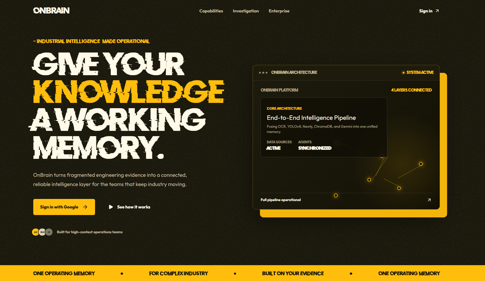
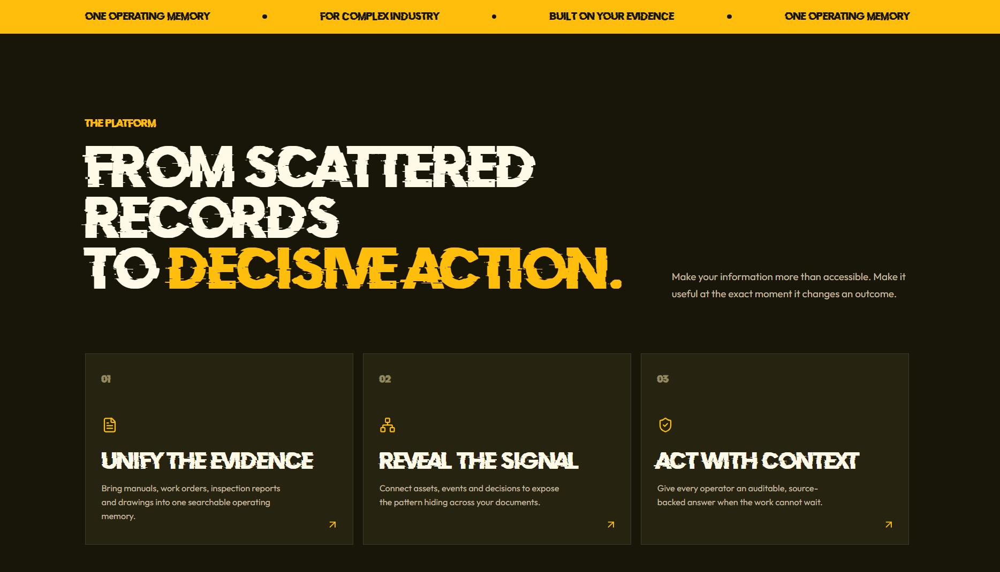
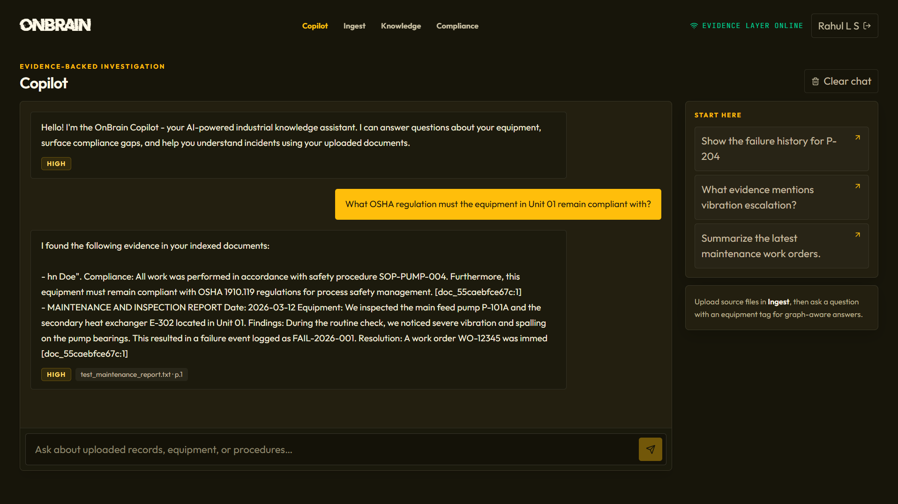
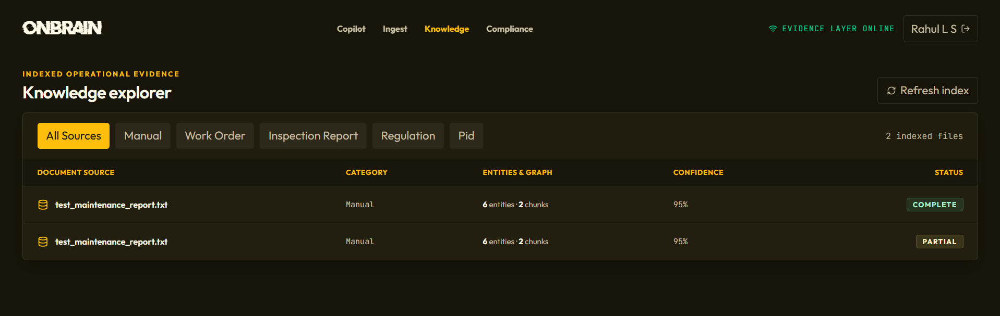
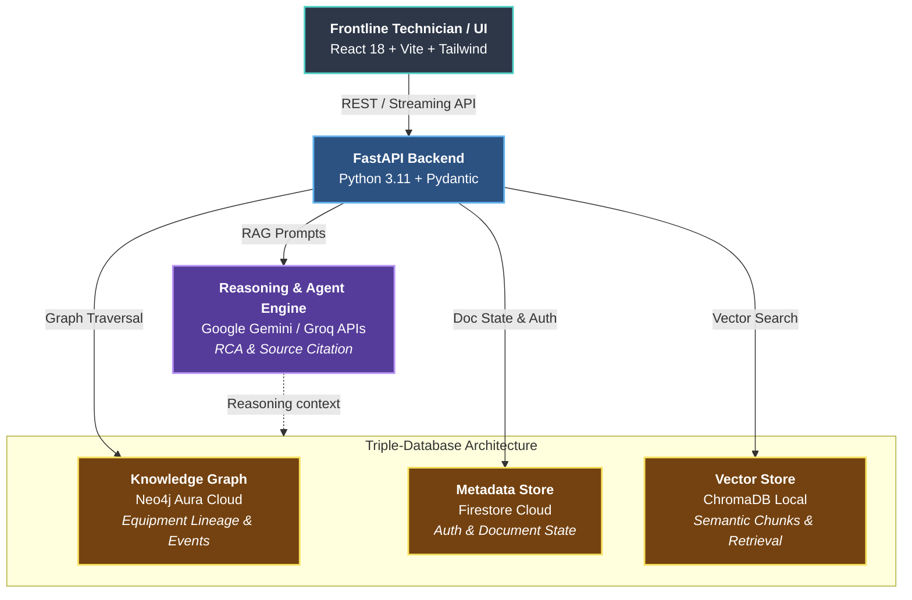

<div align="center">

# OnBrain

**Industrial Knowledge Intelligence Engine - Turning fragmented engineering evidence into a connected operating memory using Graph RAG & Generative AI.**

[](https://react.dev/)
[](https://tailwindcss.com/)
[](https://vitejs.dev/)
[](https://www.python.org/)
[](https://fastapi.tiangolo.com/)
[](https://firebase.google.com/)
[](https://ai.google.dev/)
[](https://neo4j.com/cloud/aura/)
[](https://www.trychroma.com/)

</div>

---

> **Built for the ET Gen AI 2.0 Hackathon**  
> *Problem Statement 8. AI for Industrial Knowledge Intelligence: Unified Asset & Operations Brain*

## Problem Statement

In complex industrial facilities, engineers and maintenance technicians spend **up to 35% of their working hours** manually searching across fragmented siloes — P&IDs, equipment manuals, incident logs, work orders, and ISO regulatory standards.

**OnBrain** bridges this gap by unifying unstructured engineering documents into a **Graph RAG (Retrieval-Augmented Generation)** knowledge system. By fusing **Neo4j Knowledge Graphs** (for equipment relationship mapping) with **ChromaDB Vector Stores** (for semantic chunk search) and **Google Gemini** (for reasoning & RCA synthesis), OnBrain delivers instant, verifiable, source-cited answers to frontline technicians.

---

## The Problem & Solution

| ❌ The Industrial Problem | ✅ The OnBrain Solution |
| :--- | :--- |
| **Fragmented Siloes**: Critical history is trapped across separate databases and PDF archives. | **Unified Operating Memory**: Ingests PDFs, CSVs, JSONs, and TXT files into a single graph + vector index. |
| **LLM Hallucinations**: Standard RAG often invents non-existent equipment specs or maintenance steps. | **Graph-Backed Grounding**: Every AI response requires explicit document citations and confidence scoring. |
| **Lost Expertise**: Decades of tribal knowledge vanish when senior engineers retire. | **Self-Learning Knowledge Graph**: Automatically links equipment tags (e.g., `P-204`) with historical failure events. |
| **Downtime Losses**: Slow root-cause analysis causes millions in unplanned operational outages. | **Instant Root Cause Analysis**: Automated RCA agent synthesizes failure history, OEM manuals, and inspection logs. |

---

## ✨ Key Features

### 1. Evidence-Backed Copilot
- **Conversational Intelligence**: Ask complex queries like *"What compliance gaps exist in my documents?"* or *"Show failure history for pump P-204"*.
- **Source Citations & Confidence**: Every response lists exact source documents, page numbers, and confidence metrics (`High`, `Medium`, `Pending`).
- **Clean Responsive UX**: Optimized for field mobile viewports as well as widescreen engineering control panels.

### 2. Automated Document Ingestion Pipeline
- **Multi-Taxonomy Intake**: Auto-detects and indexes manuals, work orders, inspection reports, P&ID drawings, and regulatory standards.
- **Entity Extraction**: Automatically extracts equipment tags, operational parameters, dates, and personnel.
- **Triple Database Sync**: Stores metadata in Firestore, vector embeddings in ChromaDB, and entity lineages in Neo4j Aura.

### 3. Knowledge Explorer
- **High-Density Corpus Table**: Full visibility into indexed files, chunk counts, extracted entities, and synchronization status.
- **Taxonomy Filtering**: One-click filtering by document type (*Manual*, *Work Order*, *Inspection Report*, *Regulation*, *P&ID*).

### 4. Regulatory Evidence & Compliance Scan
- **Semantic Coverage Analysis**: Search risk scenarios or procedure requirements against indexed regulatory manuals.
- **Quick-Scan Prompts**: One-click assessment chips for pressure vessel inspection intervals, pump vibration limits, LOTO safety, and ISO 9001 compliance.

---

## Application Previews

<p align="center">
  
  
  
  
</p>

---

## 🏗 System Architecture (Production-Ready)



---

## ⚡️ Getting Started (Local Development)

The architecture is fully migrated to managed cloud services for a lightweight local setup. Docker is **no longer required** for running the database services.

### Prerequisites
- **Node.js** v18+ and **npm** v9+
- **Python** 3.11+
- **Firebase Project** (with Firestore and Authentication enabled)
- **Neo4j Aura** (Free Tier graph database instance)

### 1. Clone & Configure Environment
```bash
git clone https://github.com/Tetra4ge/OnBrain.git
cd OnBrain
```

Create a `.env` file in the `backend/` directory with your cloud credentials:
```env
ENVIRONMENT=development
PORT=8000

# Cloud Graph DB
NEO4J_URI=neo4j+s://<your-aura-id>.databases.neo4j.io
NEO4J_USER=neo4j
NEO4J_PASSWORD=your_secure_password

# Local Vector DB
CHROMA_DATABASE=Onbrain

# LLMs
GROQ_API_KEY=your_groq_api_key
GEMINI_API_KEY=your_gemini_api_key

# Cloud Metadata
FIREBASE_PROJECT_ID=your_firebase_project_id
FIREBASE_SERVICE_ACCOUNT_PATH=./service-account.json
```

Create a `.env` file in the `frontend/` directory:
```env
VITE_MODE=development
VITE_API_DEV_URL=http://localhost:8000
VITE_FIREBASE_API_KEY=your_firebase_api_key
VITE_FIREBASE_AUTH_DOMAIN=your_project.firebaseapp.com
VITE_FIREBASE_PROJECT_ID=your_project
```

### 2. Launch Backend API Server
```bash
cd backend
python -m venv venv
# On Windows:
.\venv\Scripts\activate
# On Linux/macOS:
source venv/bin/activate

pip install -r requirements.txt
uvicorn app.main:app --reload --port 8000
```
*API interactive docs available at: `http://localhost:8000/docs`*

### 3. Launch Frontend Web Dashboard
```bash
cd ../frontend
npm install
npm run dev
```
*Web dashboard available at: `http://localhost:5173`*

---

## 🏆 Hackathon Evaluation Highlights

1. **Zero-Hallucination Grounding**: Unlike pure LLM chatbots, OnBrain cross-checks every generated response against both vector similarity search (ChromaDB) and graph lineage (Neo4j), providing source citations for complete auditability.
2. **True Industrial Value**: Tackles a multi-billion dollar operational problem (unplanned industrial downtime and lost engineering context).
3. **Production-Ready UX**: Responsive mobile & desktop interface designed with dark industrial aesthetics, responsive mobile navigation, and non-scrollable focus viewports.
4. **Hybrid Graph RAG Architecture**: Combines semantic embeddings with graph entity relationships for deep multi-hop reasoning.

---

<div align="center">

**Built Team TetraFourge**

© 2026 OnBrain. All rights reserved.

</div>